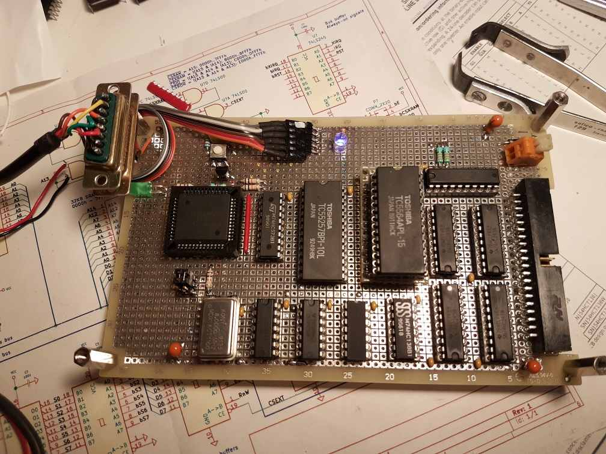
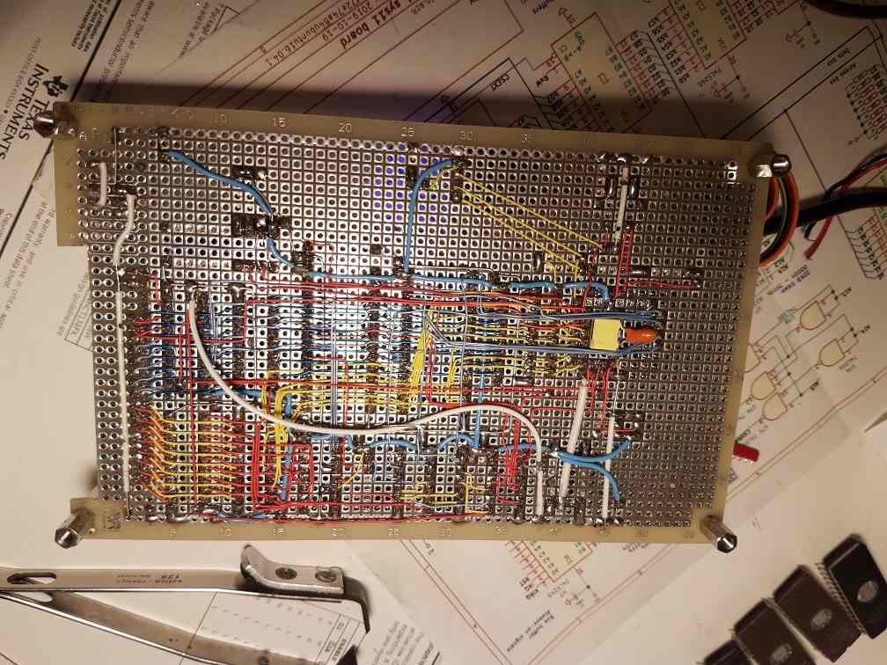

sys11
=====

This is a development board for the 68hc11 microcontroller.

The goal is to build a robust, simple, reliable, and repairable computer from
scrap, similar to what collapseOS is seeking.

The project defines two ROM images:
* a shell interface with assemble-time modular commands, development is halted.
* a forth interpreter.

Forth is a portable stack supported language wich is surprisingly powerful, even on
small targets. It has the potential to describe complex programs in a very compact way.

A lot of resources about forth are available online. This project defines a minimally small
forth interpreter with indirect threading. The goal is to build a 68hc11 interpreter that can
be used to write the interpreter itself, so it has to be as small as possible.

CPU: 68HC11A0, the most basic one. This is what I found in my drawer, and is
more desirable than a basic 6502 or other because it has integrated peripherals.
I only choose chips that I have replacement for.

Clock speed: 8 MHz XTAL / OSC, which translates to 2 MHz internal and
bus clock (Cycle time 500 ns). It seems that 16 MHz (4 MHz E clock, 250 ns
cycle) is also working. May switch to that later.

Currently sys11 is implemented on a protoboard using soldered 30AWG (wirewrap)
wires.

Memory map (HC11 extended mode)
-------------------------------

* Internal RAM kept mapped at 0x0000
* Memory Mapped Registers mapped at 0x0000 (unusual). They overlay the internal
RAM, which means internal RAM locations 00h..3Fh are not usable (except the
locations that are reserved or related to PORTB and PORTC: 0002h-0007h).

* 32KB On-board Main SRAM (62256) in 0000h - 7FFFh CSRAM = A15
* 16KB Off-board secondary SRAM (half 62256) in 8000h - BFFFh, possibly banked
for additional space using a IO register. Then we could use an even bigger RAM
chip. CSXRAM = !(A15 & !A14)
* 8KB I/O space with 8 CS lines in C000h - DFFFh (1KB per CS)
CSIO = !(A15 & A14 & !A13)
* 8KB EPROM in E000h - FFFFh - monitor and SPI flash loader. For development,
this chip can be replaced with a RAM/EEPROM/NVRAM, the board actually use a
DIL32 socket instead of 28, that exposes the nWR line. An additional pair of DIL
sockets can be used to route this signal to the actual /WR line of the debug
RAM. This is actually using a 27256 EPROM with 4 manually selected banks, to
allow for different boot images (asm, communications, shell, storage mgmt, TBD)
CSROM = !(A15 & A14 & A13)
* External bus lines are only driven when external bus is actually addressed.
It is not driven when the on-board memory (32K RAM, 8K ROM) is addressed.
CSEXT = CSIO & CSXRAM

Main address decoding can be done with a few NAND gates (7400 2-input, and 7410
3-input NAND gates).

Peripherals
-----------

* 5V power from USB
* SCI : (UART), TX and RX lines on a pin header for external communication.
10K pullups are installed to ensure proper behaviour in bootstrap mode where
PORTD is configured as open drain.
* HE10-40 connector for external bus. All lines buffered by 74xx245.

Seriously planned features
--------------------------

* Robust 5V power supply (LF50 LDO, max voltage 40V) with reverse voltage
protection
* Additional LM2575 step-down to reduce LDO heating (bypassable).
* 3 outputs (PORTA) dedicated as SPI CS selector lines (3 bits + 74138 decoder +
normal /SS line)
* I2C bus using discrete N-MOS transistor on OC lines to drive the bus in open
* Multi-VPP EPROM programmer on a secondary board
* Fully shielded aluminum enclosure for a 100x160 board

Planned vaporware features
--------------------------

* Removable SPI/I2C flash cardriges
* SCSI
* Ethernet
* MCP2515 SPI CAN
* Additional UARTs and various comm interfaces (fiber, RS422 RS485...)
* Wireless communication interfaces (AX.25, 1200 bauds packet modem)
* Audio cassette program storage (Kansas)
* Dual-port RAM in IO space for communication and shared mem with another HC11.

What is already done
--------------------
* Memory map
* Schematic (includes errors)
* I have some chips: 4x 68HC11A0, 1x 68HC11A1, 1x 68HC11E2 (thanks vince),
some 74xx245, 573, 138, 00, 10, 27256, various 32Kx8 and 8Kx8 RAMs
* Ordered a 2864 EEPROM from ebay (received, meanwhile I found another one in a junkbox)
* Bootstrap uploader in Python3.
* Working hardware prototype on 100x160 perforated board
* Clock, Reset, UART connection, power supply with decoupling
* Memory map decoder using logic gates
* The HC11 starts in bootstrap mode and successfully executes code to drive LED.
* The HC11 is able to select the expanded mode and test the 32K RAM without
  errors (and also a RAM in the dedicated 8K EPROM space).
* bootstrap program to load more memory. Initally planned to use a custom HDLC
  protocol, but will rather load S-records directly.
* IRQ lines from expansion board to cpu (were broken due to lack of pullups)

Summary: The system is validated on the soldered wirewrap euro board.

What remains to be done
-----------------------
* Editing schematic to fix errors and match reality of prototype
* Finish simulating all opcodes
* Replace fifth LS245 registers with sth that allows open drain on RST and IRQs.
* Determine next step for hardware. Secondary board with more RAM? EPROM programmer?
* NVRAM SSD using these old bq4017 samples maxim generously offered me for free
  multiple years ago (Unfortunately this board will be a one-of-a-kind add-on
  unless you have these chips available or are able to find enough RAM chips)
* Some kind of documentation storage using big EEPROMs (27C040/27C080) mapped in IO
  space using a 256-byte window. This would allow use as block storage. Same idea
  applies to the bq4017 nvrams.
* I2C bus hardware
* Design a smaller PCB that can fit in a smaller shielded box.

Software roadmap
----------------
* Bootloader for extended mode - DONE
* Malloc - WIP, almost validated
* Simulator - WIP
* Basic shell - ABANDONED
* SPI bus driver - Should workd
* Block device system - ABANDONED
* Forth - WIP

* SPI and/or I2C EEPROM driver
* I2C bus driver

Abandoned features that should be implementable in forth
--------------------------------------------------------
* Assembler
* Self host the system

Abandoned features that are useless or too complex
--------------------------------------------------
Or may be done later...
* ed-based text editor
* Definition of a position independent binary format
* IO kernel
* Program loader
* RTOS

SPI bus
-------
The HC11 hardware SPI bus wil be used in master mode.
* The SS line is used as OE for a 74138 decoder that provides 8 CS lines from
3 OC lines of port A.

I2C bus
-------
A proper i2c bus needs two bidirectionnal open drain lines, which are not
available on the HC11 if one wants to benefit from the hardware SPI block on
PORTD. Moreover, the HC11 does not have a hardware i2c, so bitbanging must be
used.

The i2c bus will be done on port A using Input Capture and Output Compare lines.
To read SDA and SCL, the IC1 and IC2 lines are used. To write the bus, the OC1
and OC2 lines are used to drive small BS170 MOSFETs. This requires inversion of
the bits to write, which is not a big problem for the driver.

FAQ
---
Q: Why move to Forth?

A: At first I did not want it, and I planned to build an assembler and shell to
be able to compile source assembly files and rebuild the system from itself.
While doable, this will use a lot of memory, both flash and RAM. Just a shell and
still-not-working block device system was using 800 bytes, or 1/10 of the rom space.

It is pitiful to have 8k of ROM and only be able to have an assembler program, and
nothing else.

Meanwhile CollapseOS, which was going in the same direction, realized the potential
of forth and started implementing it. I followed the movement for several reasons:
* Forth is portable, the same routines are able to work on "any" forth implementing
machine, whatever the underlying CPU. This greatly increases the potential of collapse
recovery machines.
* It is still possible to write an assembler in forth, even cross assemblers are possible,
which still increases the ability to mix different machine in a portable software environment.
* It has the potential to express quite complex software constructs in a very compact manner

Q: Why not use a 6502?

A: Because the 6502 has a 8-bit stack pointer which is ridiculously restrictive.
We are not anymore in the situation where the 6800 was $179 and the 6502 was $29.

A2: Going to forth, the underlying CPU is not so important since Forth can be implemented
on a variety of machines.

Q: Why not use a Z80?

A: Because I did not have one when I started this project. However, I plan to
have an assembler for this target. If you want to play with the Z80, have a
look at the RC2014 project and/or github.com/hsoft/collapseos.

The HC11 is a microcontroller, which usefully comes with an integrated UART and
SPI peripherals. The Z80 does not, so it requires external bus peripherals.
However, the Z80 can hook these devices to its IO bus, saving space for more RAM
on the memory bus.

At some point it may be more interesting to build a Z80 system, to benefit from
more RAM, and also more registers, even if the Z80 requires more cycles to
execute every instruction.

Other CPUs are also interesting to increase the potential for collapse recovery:
ARM and MSP430 are such interesting targets, even the x86.

